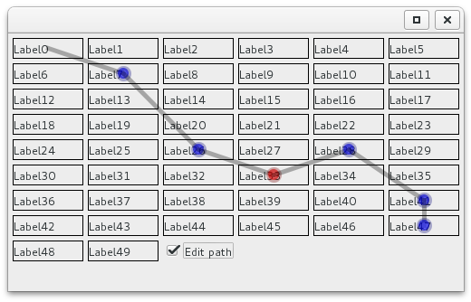

# chunk editors concepts

Little tools evolving to compound a diff chunk editor

## Screenshots

## Usage

This is best used with [mvnexec](https://github.com/albfan/mvnexec):

    $ mvnexec # or mvnexec -BDCP when there's no code changes
    1) org.albfan.leven.ColorComboRenderer
    2) org.albfan.leven.ColorMix
    3) org.albfan.leven.ComponentLinker
    #?

## Objetives

- Create a path from origin to revised data
- Choose a color for changes
- Use glasspane over existing components

